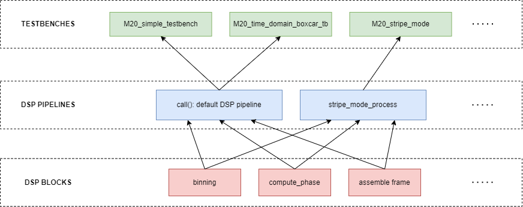
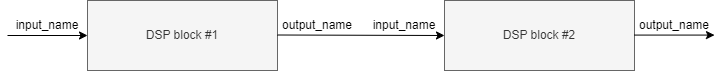

**********************
M20 model
**********************

The M20 model can be best described by its components:

1. The **testbenches** folder is the point of entry to use pyr2d. It contains experiments that define the input data, the actual DSP engine and the output analysis. Have a look at **M20_simple_testbench.py** for a simple example.
2. The **M20_iTOF_data_generator.py** file contains utility functions to load data in a suitable format.
	- **load_sensor_data**: Method to use to load experimental ROIs (data dumped by R2D).
	- **load_rm_data**: Method to use to load range model exported data.
3. The **M20_GPixel.py** file is the top level file that defines the DSP chain. It is where DSP blocks are appended one after the other using different configurations depending on the mode of operation.
	- **__call__**: Golden model. It can contain experimental blocks but they should be disabled by default. This is the method to use for vector matching.
	- **stripe_mode_process**: Use this when experimenting with stripe mode.
	- **process_from_frame**: Use this when the input data is not ROIs but frames (first DSP block is Gaussian smoothing, as of today).
4. The **M20_iTOF_DSP.py** file contains all the DSP blocks in no particular order. This file acts as a DSP library. 
5. The **M20_iTOF_viewer.py** contains utilities to analyze and view the data.

Architecture
--------------
The architecture of pyr2d is given by:

DSP blocks are assembled together to create DSP pipelines. Those pipelines are then imported into testbenches
to create experiments.

Custom M20 data type
---------------------------
The M20_DSP_Data class is designed to facilitate labeling of numpy arrays and the use of concurrent floating and fixed point arrays. Using
this class, an array is uniquely identified by its name.

Assembling a DSP pipeline
---------------------------
The following image illustrates how the DSP pipeline is interconnected using the names of input and output arrays.
In order for the data of all intermediate processing stages to be available, the DSP device has a dictionary of
M20_DSP_Data objects. Each entry in that dictionary represents a data stage.

