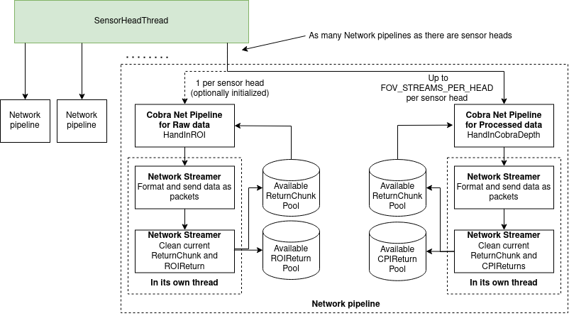

Cobra net pipeline
===================
This net pipeline can output processed data (FoVs) and raw data.

Architecture
---------------------
The following diagram describes the architecture of the net pipeline. As can be seen, there is a network pipeline per sensor head. Each network pipeline is made of up to FOV_STREAMS_PER_HEAD (currently 8) processed data pipeline and an optional raw data pipeline. The processed data pipelines each have their own thread and memory pool. They are also isolated from the optional raw data pipeline which has its own memory pool and thread as well. Note that the CPIReturn and ROIReturn pools are what's taking up most of the memory, the ReturnChunk pool is essentially a bunch of pointers. 

Description of files
---------------------
* **cobra_net_pipeline**: top wrappers for processed data and raw data. This file contains the interfaces for the SensorHeadThread to format and hand in the data to the network streamer.
* **network_streamer**: pipeline module (running in it's own thread) that manages the network connection, fires off the packets, etc.
* **pipeline_modules**: parent class that manages all things related to threading.
* **pipeline_data**: manages the data types and memory pools.

Hardware note
---------------------
Avoid using 100 Mbps links with this pipeline (it has been extensively tested with 1 Gpbs links).

TCP buffer note
---------------------
Make sure TCP send buffer is large enough (frontend will exit if not). E.g.:   
**sudo sysctl -w net.core.wmem_max=181632000**

Notes related to the usage of raw data net wrapper
-----------------------------------------------------
**The raw data net wrapper is currently not supported.**
